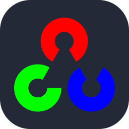

### Hi,I'm Abdul Rehman Nazeer.

## I'm a Student, Developer, and Teacher!!

- 🌱 Studying at FAST NUCES Karachi.
- 🌱 Currently learning HTML,CSS,JS and MERN Stack.
- 🔭 I know a handfull of programming languages.
- 💬 Ask me about Maching Learning, AI and WebDev.
- 💗 I love making mini side Projects that boosts my self confidence and enhances my coding experience.
- 📫 How to reach me abdulrehmannazeer045@gmail.com

### Connect with me:

    
    &nbsp;&nbsp;
    
    &nbsp;&nbsp;
    
    &nbsp;&nbsp;
    

## Languages and Tools

&nbsp;&nbsp;
&nbsp;&nbsp;
&nbsp;&nbsp;
&nbsp;&nbsp;
&nbsp;&nbsp;
&nbsp;&nbsp;
&nbsp;&nbsp;
&nbsp;&nbsp;
&nbsp;&nbsp;
&nbsp;&nbsp;
&nbsp;&nbsp;
&nbsp;&nbsp;
&nbsp;&nbsp;
&nbsp;&nbsp;
&nbsp;&nbsp;
&nbsp;&nbsp;
&nbsp;&nbsp;
&nbsp;&nbsp;
&nbsp;&nbsp;
&nbsp;&nbsp;
&nbsp;&nbsp;
&nbsp;&nbsp;
&nbsp;&nbsp;
&nbsp;&nbsp;
&nbsp;&nbsp;
&nbsp;&nbsp;
&nbsp;&nbsp;

 
 

---
<h3>:bar_chart: My GitHub Stats</h3>

My recent activity

<!--RECENT_ACTIVITY:start-->
1. ⭐ Starred [Externalizable/bongo.cat](https://github.com/Externalizable/bongo.cat) 
<!--RECENT_ACTIVITY:end-->

<!--RECENT_ACTIVITY:last_update-->
Last Updated: Wednesday, January 1st, 2025, 9:31:15 AM
<!--RECENT_ACTIVITY:last_update_end-->

    
My GitHub stats

    

        
        
        
        <!-- -->
        
        <!-- -->
    

    
     
    
    
    
    
    <!---->
     
    <b>*Note:</b> Top languages is only a metric of the languages my public code consists of and doesn't reflect experience or skill level.

    
You can see my full metrics <a href="https://metrics.lecoq.io/insights/Abdul-Rehman-Nazeer">here</a>.
